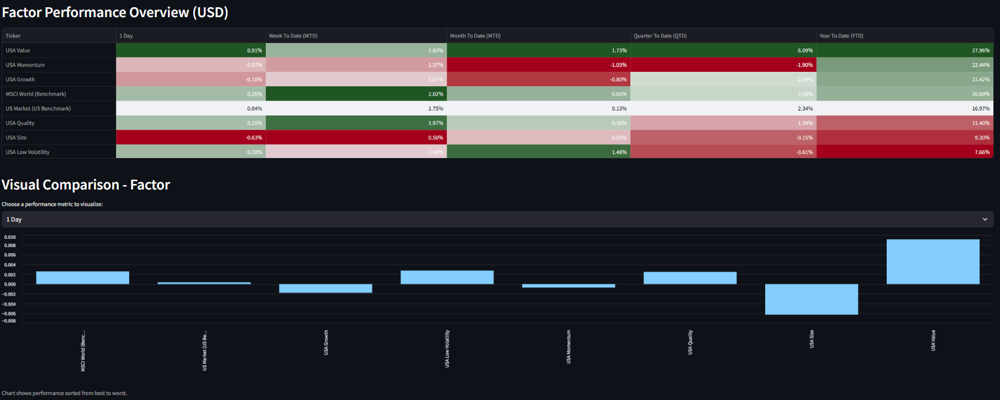
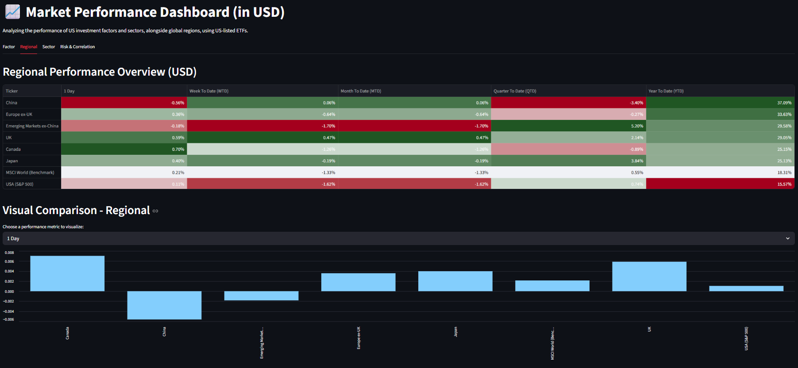
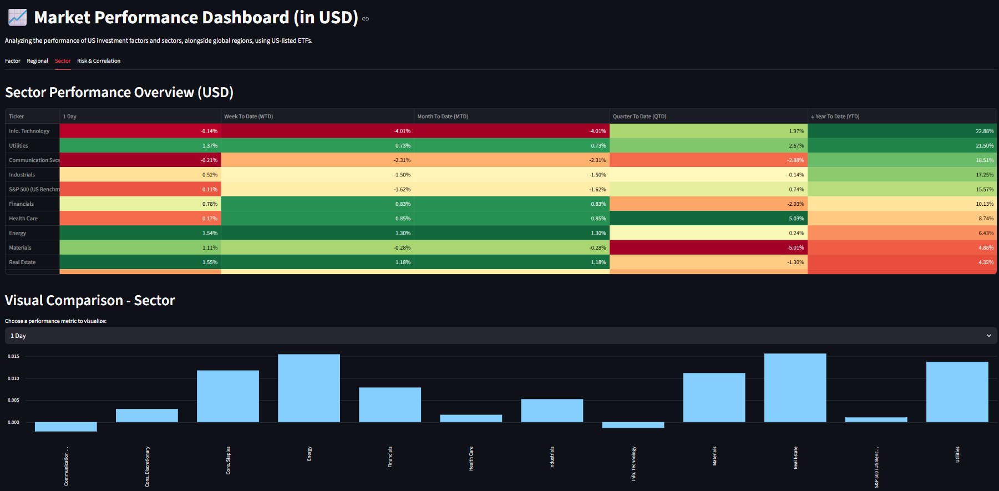
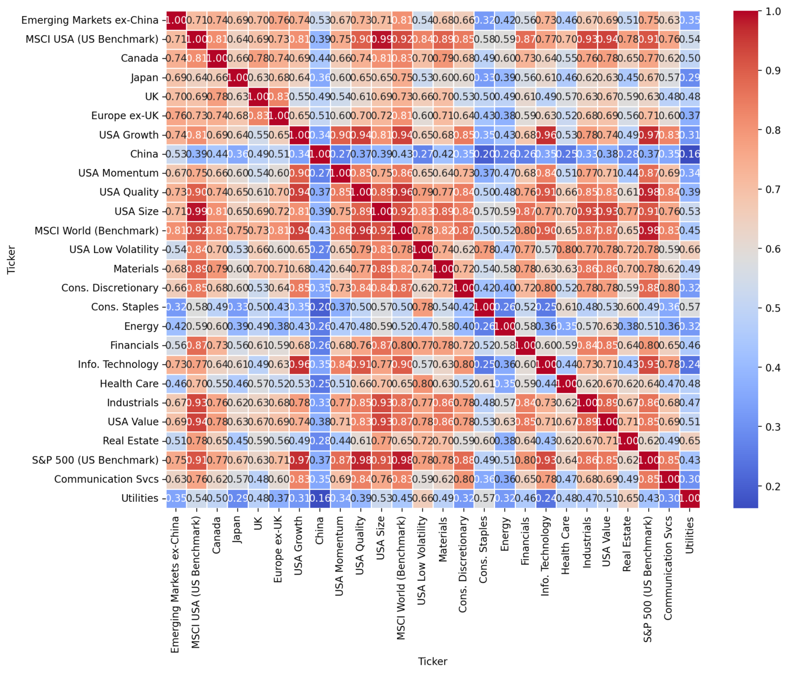
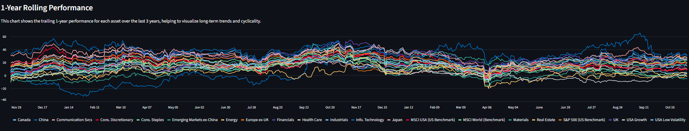

# Market Performance Dashboard (in USD)

This project is an interactive web-based dashboard built with Python and Streamlit to analyze the performance of US investment factors and sectors, alongside global regions, using US-listed ETFs.

## Core Features

The dashboard is organized into four main tabs, each providing a unique analytical view:

### 1. Factor Performance

- Tracks the performance of key US investment factors (Momentum, Value, Quality, Growth,Low Vol, Size) against the US Market as a primary benchmark.

Rendered result:  


### 2. Regional Performance

- Compares the performance of major geographic markets, including the USA, UK, Japan, Europe ex-UK, and Emerging Markets.
- The **MSCI World (Benchmark)** is included directly in the table for immediate performance comparison.



### 3. Sector Performance

- Provides a breakdown of the 11 major GICS sectors of the US market, benchmarked against the US Market benchmark.
- The **US Market (Benchmark)** is also included here for easy relative analysis.



### 4. Risk & Correlation

- **Correlation Heatmap:** A visual grid that shows how different assets move in relation to each other, offering a clear picture of diversification.
- **1-Year Rolling Performance Chart:** A line chart that displays the trailing 1-year performance of all assets over the last three years, helping to identify long-term trends and cyclical behavior.

Rendered results:  
  


## Technical Details

### Tech Stack

- **Python:** The core programming language.
- **Streamlit:** For creating the interactive web application.
- **Pandas:** For data manipulation and analysis.
- **yfinance:** For downloading financial market data from Yahoo Finance.
- **Matplotlib & Seaborn:** For creating the advanced charts and color gradients in the visualizations.

### Setup and Installation

To run this dashboard, you need to have Python installed. Then, install the required libraries using pip:

```bash
pip install streamlit pandas yfinance matplotlib seaborn
```

### How to Run the Dashboard

1. Save the script as `factor_dashboard.py`.
2. Open your terminal or command prompt.
3. Navigate to the directory where you saved the file.
4. Run the following command:

```bash
streamlit run factor_dashboard.py
```
